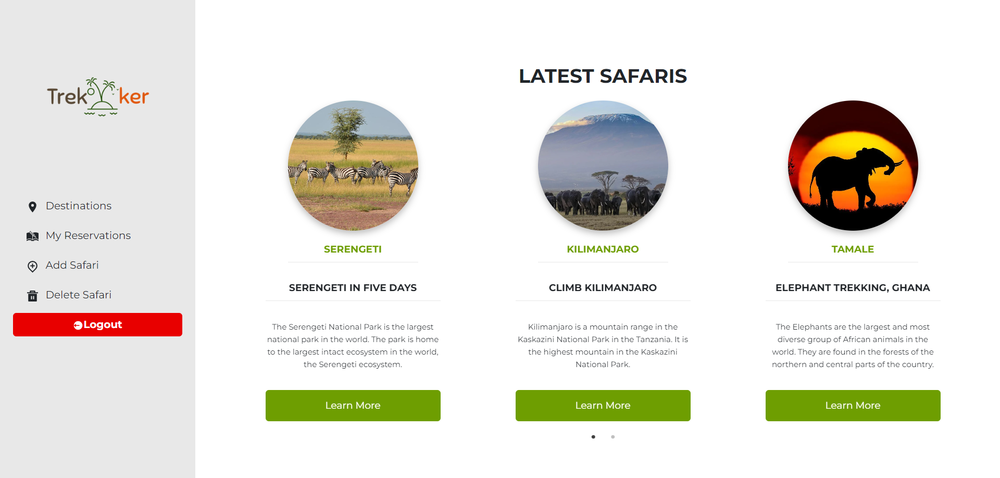

# Trekker-App

> An app where you can book yor dream holiday vacation

## Built With

- HTML, CSS & SCSS
- JavaScript
- React
- Webpack

## Live demo

🔗 [Follow the link](https://mv-trekker.netlify.app/)

🔗 [Link to Back-end](https://github.com/dewslyse/trekker-back-end)

### Kanban Board

 Project Start| Project Done
------------- | -------------
  | 

## Screenshot

 

## Getting Started

To get a local copy up and running follow these simple example steps.

- copy this link `https://github.com/dewslyse/trekker-front-end`.
- get the directory that you want to clone the repository.
- open the command prompt in this directory.
- write `https://github.com/dewslyse/trekker-front-end`.
- go to the repository folder in your command prompt.
- run `bundle install`.
- run `npm install`

### Test 
- run `npm run test`

## Author
👤 **Teshome Kurabachew**

- GitHub: [@githubhandle](https://github.com/TesheMaximillan)
- Twitter: [@twitterhandle](https://twitter.com/TesheKura)
- LinkedIn: [LinkedIn](https://www.linkedin.com/in/teshome-kurabachew-aa8067180/)

👤 **Kemigabo Catherine**

- GitHub: [@githubhandle](https://github.com/kemigabocatherine)
- Twitter: [@twitterhandle](https://twitter.com/home?lang=en)
- LinkedIn: [LinkedIn](https://www.linkedin.com/in/kemigabocatherine/)

👤 **Amina Buhari**

- GitHub: [@githubhandle](https://github.com/AminaBuhari)
- Twitter: [@twitterhandle](https://twitter.com/AminaBuhari)
- LinkedIn: [LinkedIn](https://www.linkedin.com/in/amina-buhari/)

👤 **Selase**

- GitHub: [@dewslyse](https://github.com/dewslyse)
- LinkedIn: [Selase](https://github.com/dewslyse)

## 🤝 Contributing

Contributions, issues, and feature requests are welcome!

Feel free to check the [issues page](../../issues/).

## Show your support

Give a ⭐️ if you like this project!

## Acknowledgments
Original design idea by: [Murak Korkmaz](https://www.behance.net/gallery/26425031/Vespa-Responsive-Redesign)

## 📝 License

This project is [MIT](./LICENSE) licensed.